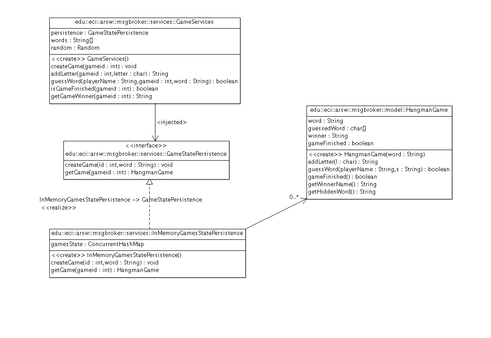
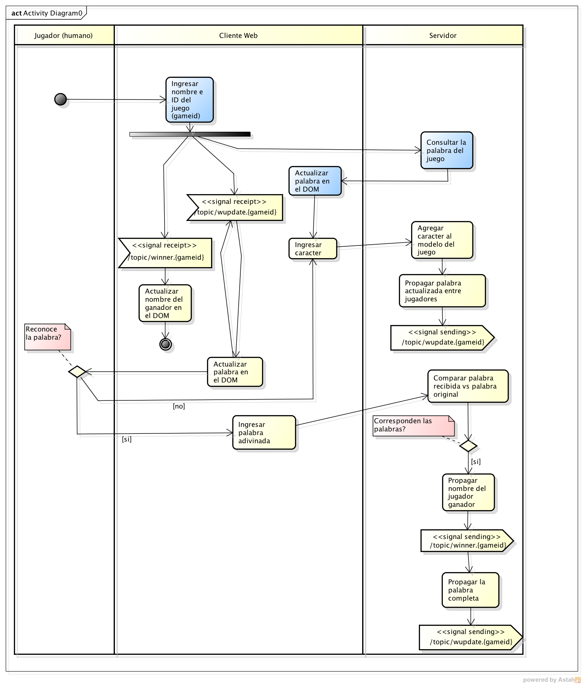

#### Escuela Colombiana de Ingeniería
#### Arquitecturas de Software - ARSW
#### Parcial Segundo Tercio - Práctico


## Ahorcado  multijugador

Este repositorio tiene una versión incompleta de una variante del popular juego "ahorcado". Esta versión difiere del orignal en cuanto que:

* Una partida se puede realizar simultáneamente entre varios jugadores, y el sistema permite realizar varias partidas simultáneamente. Es decir, una vez asociados a una partida, todos los jugadores pueden solicitar 'descubrir' si la palabra tiene una determinada letra, e intentar adivinar la palabra. Por ejemplo, es posible que inmediatamente después de que un jugador acierte con una letra faltante, el otro adivine la palabra.
* Por ahora, el juego no se pierde al alcanzar un número máximo de intentos, sino sencillamente gana el primero que adivine la palabra.
* Por ahora, no se tendrá la funcionalidad de 'creación de partidas', por lo que se deberá jugar en alguna de las partidas ya existentes (#1, #2, #3 y #4).
* Por ahora, se asume que cada jugador utilizará un nombre diferente.


En la versión actual, ya se tiene implementada una capa lógica (puede revisar la documentación de la clase GameServices) y una capa de 'persistencia'. Esta última es responsable de mantener el estado de las diferentes partidas (objetos HangmanGame) que se realizan simultáneamente:



1. Complete la funcionalidad del juego, siguiendo como especificación el siguiente diagrama de actividades. Tenga en cuenta que lo que está en azul ya está implementado, y que del diagrama se debe inferir qué estilos arquitectónicos se deben considerar en cada caso:

	


* Nota 1: las cadenas "/topic/winner.{gameid}" y "/topic/wupdate.{gameid}" indican que {gameid} será un valor variable dentro de los nombres de los tópicos, y coresponderá al identificador del juego en curso. Por ejemplo: "/topic/winner.2",  "/topic/winner.43", etc.
	

* Criterios de evaluación:
	1. [30%] Corresponencia entre el diagrama de actividades y la implmentación, Nivel de madurez (Richardson) de los recursos REST.
	2. [40%] El juego permite UNA partida colaborativa.
	3. [30%] El juego permite VARIAS partidas colaborativas, sin que unas interfieran con las otras.

## Entrega

Siga al pie de la letra estas indicaciones para la entrega del examen. EL HACER CASO OMISO DE ESTAS INSTRUCCIONES PENALIZARÁ LA NOTA.

1. Limpie el proyecto

	```bash
$ mvn clean
```

1. Configure su usuario de GIT

	```bash
$ git config --global user.name "Juan Perez"
$ git config --global user.email juan.perez@escuelaing.edu.co
```

2. Desde el directorio raíz (donde está este archivo README.md), haga commit de lo realizado.

	```bash
$ git add .
$ git commit -m "entrega parcial - Juan Perez"
```


3. Desde este mismo directorio, comprima todo con: (no olvide el punto al final en la segunda instrucción)

	```bash
$ zip -r APELLIDO.NOMBRE.zip .
```
4. Abra el archivo ZIP creado, y rectifique que contenga lo desarrollado.

4. Suba el archivo antes creado (APELLIDO.NOMBRE.zip) en el espacio de moodle correspondiente.

5. IMPORTANTE!. Conserve una copia de la carpeta y del archivo .ZIP.
